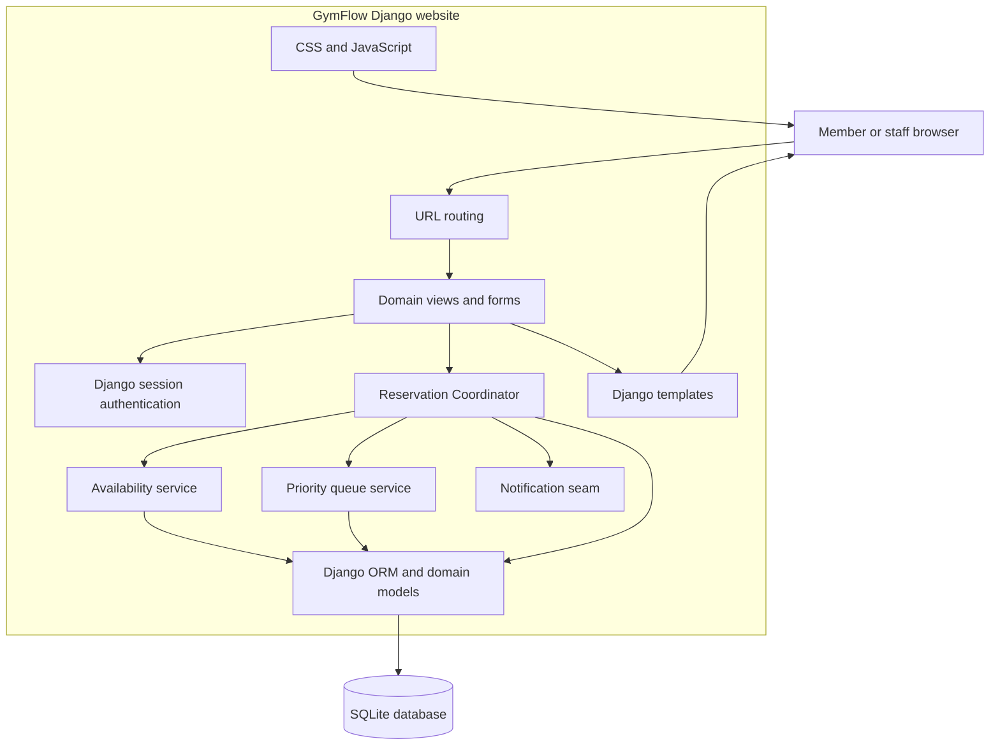
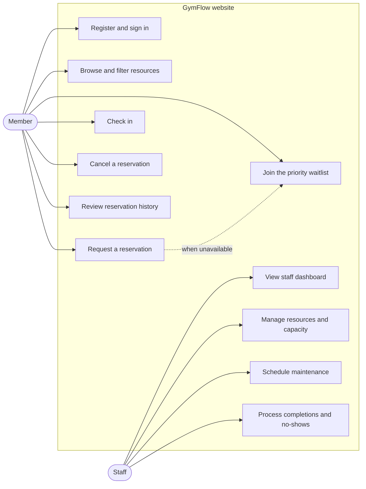
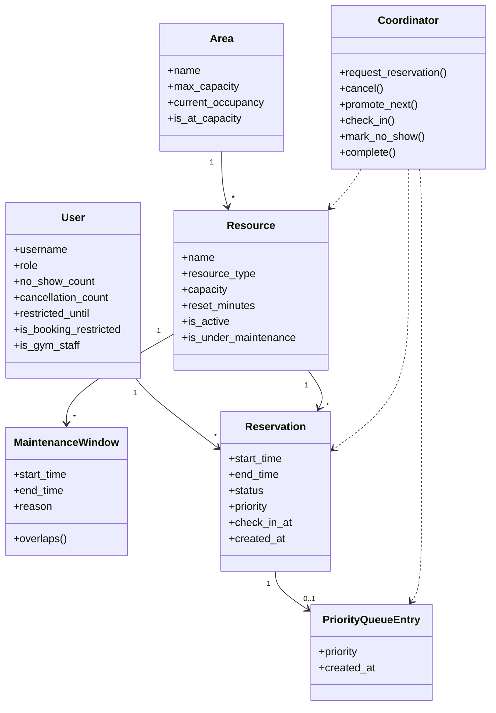
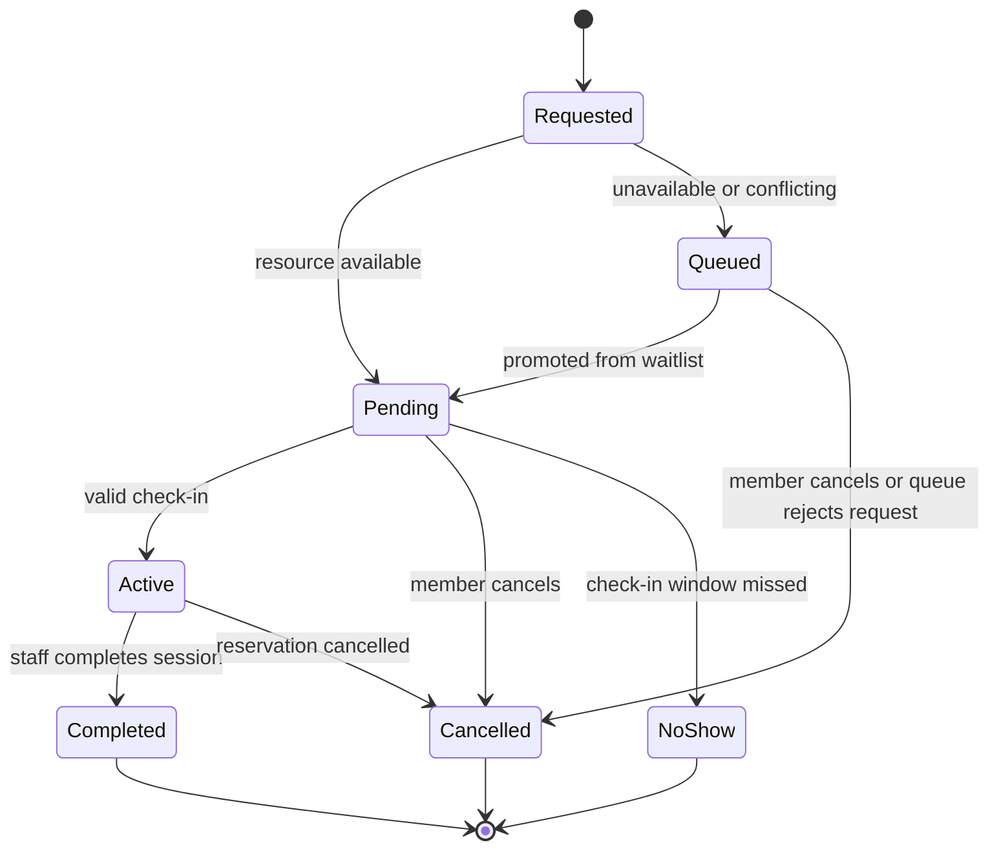

# GymFlow System Diagrams

These diagrams describe the implemented Django website. GitHub and IDE Markdown
previewers with Mermaid support render them directly. The original PlantUML
source and exported class/use-case SVG files remain available in the repository.

## 1. System Architecture

## 2. Use Cases

## 3. Domain Class Diagram

## 4. Reservation State Diagram

## Existing Exported UML

- [Class diagram SVG](../UMLdiagrams/gymflow_uml/class_diagram.svg)
- [Use-case diagram SVG](../UMLdiagrams/gymflow_uml/use_case_diagram.svg)
- [PlantUML source](../gymflow_uml.puml)
