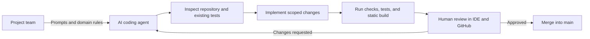

# GymFlow Agent Prompt and Context Record

## Purpose

This file records the project context, representative prompts, decisions, and
verification produced during AI-assisted development. It is intended to be
opened in the IDE during the project presentation.

This is a curated development record, not a verbatim export of the complete
chat. Authentication codes, tokens, passwords, secret keys, and unrelated
conversation details are intentionally excluded.

## Context Supplied to the Agent

- Build a server-rendered Django website for a university recreation center.
- Support member registration, authentication, resource browsing, reservations,
  waitlists, check-ins, cancellations, and reservation history.
- Give staff a protected dashboard for resource, maintenance, capacity, and
  attendance management.
- Prevent double-bookings and enforce three-minute equipment resets and
  five-minute room, court, and group-area resets.
- Order waitlists by accessibility, team, class, and individual priority, then
  use FIFO ordering within the same priority.
- Restrict members for seven days after three no-shows.
- Use Django templates, CSS, JavaScript, SQLite for local development, and
  domain-based Django apps.

The detailed product brief is stored in
[`design_specification.md`](design_specification.md).

## Representative Prompt Record

### Prompt 1: Product and Architecture Brief

> Build a Django reservation system for a university recreation center. The
> central Coordinator service should assign reservations, prevent unsafe
> overlaps, operate priority waitlists, and record member attendance.

Result:

- Organized the website into `accounts`, `resources`, `reservations`, and
  `dashboard` Django apps.
- Moved booking decisions into the reservations service layer.
- Added models, forms, views, templates, migrations, seed data, and automated
  tests.

### Prompt 2: Production Preparation

> Prepare the new nikaalis/GymFlow Django app for a production deployment: move
> DEBUG, ALLOWED_HOSTS, CSRF trusted origins, and secret configuration into
> environment variables; configure static-file serving; add the minimal
> deployment dependencies and documentation; then open a PR with the changes. I
> want a website, not an app.

Result:

- Made the secret key required and moved deployment-specific settings to
  environment variables.
- Added WhiteNoise static-file serving, secure production cookies, Gunicorn, and
  a `Procfile`.
- Added deployment instructions and opened GitHub pull request
  [#1](https://github.com/nikaalis/GymFlow/pull/1), which was reviewed and
  merged into `main`.

### Prompt 3: Private Local Demonstration

> What if I just ran it locally?

Result:

- Confirmed that Django's default `127.0.0.1:8000` binding is accessible only
  from the local computer.
- Configured the local environment, applied migrations, loaded sample resources,
  and verified that the GymFlow home page returned HTTP 200.

### Prompt 4: IDE Evidence and Diagrams

> For our project we need to go into the IDE and show that we have given the
> agent prompts and context. Add a prompt or context file, and make diagrams.

Result:

- Added this prompt/context record.
- Added architecture, use-case, domain-class, and reservation-state diagrams in
  [`docs/diagrams.md`](../docs/diagrams.md).
- Linked the documentation from the main README so it can be found quickly
  during a presentation.

## Agent-Assisted Development Workflow

## Responsibilities

| Project team | Agent assistance |
| --- | --- |
| Defined the problem and university-gym rules | Translated the rules into Django components |
| Chose the website scope and local presentation approach | Implemented and documented the selected approach |
| Reviewed the website and GitHub pull request | Ran automated tests and deployment checks |
| Retains responsibility for the submitted project | Produced code and documentation for human review |

## Verification Evidence

- Django system check: no issues.
- Automated test suite: 18 tests passed.
- Static build: 129 files copied and 387 post-processed.
- Local website request: HTTP 200 at `http://127.0.0.1:8000/`.
- Production preparation: five-file pull request merged into `main`.

## IDE Presentation Checklist

1. Open this file and explain how prompts were converted into implementation
   tasks.
2. Open `prompts/design_specification.md` to show the detailed domain rules.
3. Preview `docs/diagrams.md` to explain the architecture and reservation flow.
4. Open `apps/reservations/services/coordinator.py` to connect the diagrams to
   the implementation.
5. Open the test files and run `python manage.py test` to show verification.
